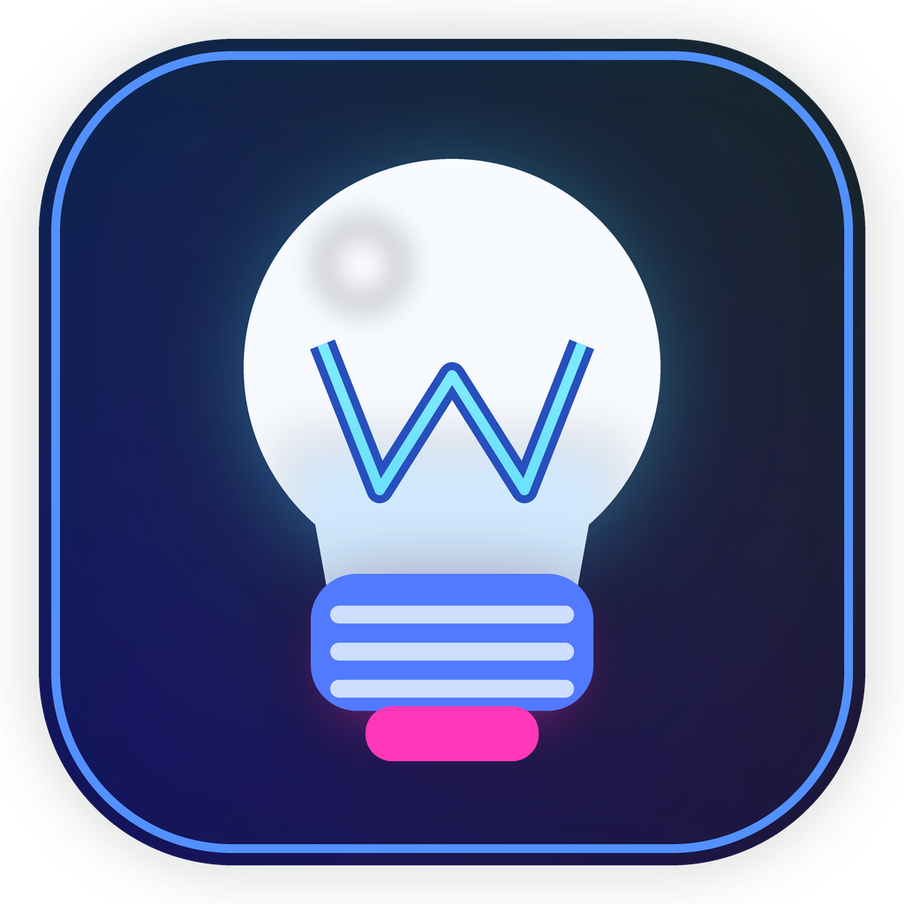

**Español** · [English](README.md)

# WizZ Desktop

### Control local para ampolletas WiZ

[Descargar](https://github.com/yvvvl/WizzController/releases/latest) · [Reportar un problema](https://github.com/yvvvl/WizzController/issues) · [Apoyar el desarrollo](https://github.com/sponsors/yvvvl)

---

WizZ Desktop controla ampolletas WiZ en tu red local. Los comandos habituales
usan el protocolo WiZ UDP LAN, sin depender de un servicio en la nube. La
aplicación de escritorio compatible usa Qt/PySide6 y está disponible para
**Windows x64** y **Linux compatible con Ubuntu x64/ARM64**. macOS sigue en
fase experimental.

## Novedades de v1.5.0

- Programa rutinas localmente por hora y día de la semana, con una ampolleta
  o grupo guardado como destino predeterminado. Puedes editarlas o pausarlas.
- Graba atajos Windows como combinaciones reales, distingue el teclado
  numérico del principal y elige visualmente blancos Kelvin exactos.
- Usa listas de acciones más claras, el selector mejorado de Color Studio y
  un logo que refleja el color de una única ampolleta activa.

Lee el [changelog completo](CHANGELOG.md#v150). La app debe seguir abierta
para ejecutar horarios, aunque esté en la bandeja; las horas perdidas no se
recuperan. Los hotkeys globales aún son exclusivos de Windows. Screen Sync y
sincronización de audio no forman parte de esta release.

## Primeros pasos

1. [Descarga la última versión](https://github.com/yvvvl/WizzController/releases/latest).
   Windows ofrece instalador o ZIP portable; Linux ofrece paquetes x64 y
   ARM64 con instalador por usuario. Los ZIP/tar incluyen archivos SHA-256.
2. Instala o extrae el paquete completo y abre **WizZ Desktop**. En Windows
   portable, mantén `_internal` junto al ejecutable.
3. Conecta el PC y las ampolletas WiZ a la misma red. Búscalas en **Ajustes**
   o agrega manualmente una IP local conocida.
4. Selecciona una, varias o todas y usa Inicio, Color Studio, Escenas,
   Favoritos, Rutinas o el panel rápido.

Las instalaciones compatibles pueden actualizarse desde **Ajustes → Buscar
actualización → Instalar y reiniciar**. La
[guía de instalación](docs/installation.es.md) explica checksums, requisitos
Linux, rutas de datos y desinstalación.

## Funciones principales

| Área | Funciones |
| --- | --- |
| Luces | Encendido, brillo, RGB, blancos Kelvin, escenas WiZ, búsqueda, IP manual y selección múltiple. |
| Color Studio | Paleta de matiz/saturación, brillo y CCT independientes, valores exactos, recientes y favoritos. |
| Automatización | Rutinas de varios pasos, grupos guardados y horarios locales por día y hora. |
| Escritorio | Panel rápido movible y magnético, bandeja, inicio de sesión, temas, idiomas español/inglés y actualización desde la app. |
| Hotkeys Windows | Atajos globales nativos que distinguen Numpad y admiten RGB/Kelvin personalizados. |

El control habitual permanece en la LAN. Configuración y logs quedan en el
equipo; pueden contener IP/MAC de las luces y deben ocultarse antes de
compartirlos. Consulta las [rutas de datos](docs/installation.es.md#verificación-y-datos-guardados).

## Documentación y desarrollo

- [Índice de documentación](docs/README.md): guías en español e inglés.
- [Validación de release](docs/release-validation.es.md): pruebas con luces
  reales, bandeja y actualización empaquetada.
- [Horarios locales](docs/local-routine-schedules.es.md): destinos, reloj,
  límites y pruebas.
- [Desarrollo](docs/development.es.md): entorno, ampolletas virtuales,
  tests, arquitectura y scripts de build.
- [Contribuir](CONTRIBUTING.md) y [política del repositorio](docs/repository-maintenance.md):
  organización del código, limpieza segura y datos que deben permanecer locales.

Para ejecutar desde el código fuente, instala los requisitos y usa
`python -m qt_ui.run`. Define `WIZZ_DEV_VIRTUAL_BULBS=3` solo si quieres
un perfil de prueba simulado que no envía tráfico WiZ LAN. Los paquetes
públicos ignoran esa variable.

La interfaz y los scripts vigentes están en `qt_ui/` y `build_qt_*`. `ui/`
conserva el antiguo código Flet por migración y pruebas históricas; no se
empaqueta ni se abre para usuarios. Consulta el
[mapa de rutas actuales y de legado](docs/development.es.md#rutas-actuales-y-de-legado)
antes de cambiar o eliminar archivos.

## Proyecto y agradecimientos

WizZ Desktop es un proyecto independiente de **Ignacio** (`yvvvl`), sin
afiliación con WiZ Connected ni Signify. Si te resulta útil, puedes
[apoyar su desarrollo](https://github.com/sponsors/yvvvl); también ayudan
mucho los comentarios y reportes reproducibles.

El repositorio **todavía no tiene una licencia propia seleccionada**. Los
[avisos de terceros](THIRD_PARTY_NOTICES.md) y archivos en `licenses/`
corresponden a dependencias y recursos incluidos, no al código del proyecto.
