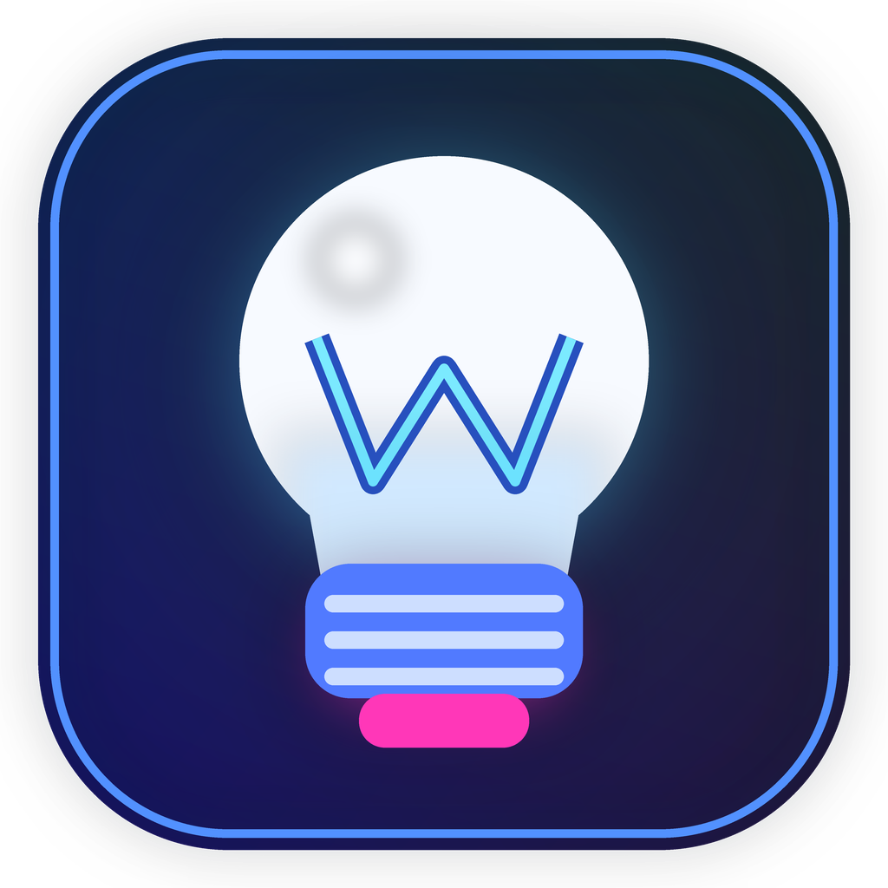

<div align="center">



# WizZ Desktop

### Control local, rápido y privado para ampolletas WiZ en Windows

[](https://github.com/yvvvl/WizzController/releases/latest)
[](https://github.com/yvvvl/WizzController/actions/workflows/ci.yml)
[](https://github.com/yvvvl/WizzController/actions/workflows/build-windows.yml)
[](https://www.python.org/)
[](https://flet.dev/)

[Descargar última versión](https://github.com/yvvvl/WizzController/releases/latest) · [Reportar un problema](https://github.com/yvvvl/WizzController/issues)

</div>

---

## Qué es WizZ Desktop

**WizZ Desktop** es una aplicación de escritorio para controlar ampolletas WiZ directamente dentro de la red local.

Las acciones normales se envían por **UDP LAN nativo**, por lo que el control no depende de la nube de WiZ y mantiene una respuesta rápida incluso cuando la conexión a Internet no está disponible.

La aplicación está diseñada para Windows y combina control de iluminación, automatizaciones, hotkeys globales y una interfaz moderna en un único programa portable.

> Versión actual: **v1.0.0 · build 1**

---

## Funciones principales

### Control local WiZ

- Encendido, apagado y alternancia.
- Brillo independiente mediante `dimming`.
- Colores RGB.
- Blancos configurables por temperatura Kelvin.
- Escenas oficiales WiZ.
- Sincronización con cambios realizados desde la aplicación móvil.
- Control de una ampolleta específica o de todas las detectadas.

### Color Studio

- Paleta perceptual de matiz y pureza.
- Color visible y valor enviado calculados desde la misma fuente.
- Brillo separado del RGB.
- Blancos Kelvin separados del modo color.
- Edición precisa mediante HEX, RGB, H y S.
- Aplicación en vivo o manual.
- Colores recientes, favoritos y presets.
- Conversión del color lógico hacia los canales físicos RGBTW de WiZ.
- Arrastre fluido con protección de bordes y coordenadas fuera del picker.

### Automatización

- Favoritos para acciones rápidas.
- Rutinas con múltiples pasos.
- Acciones compatibles:
  - color;
  - blanco;
  - brillo;
  - escena;
  - espera.
- Ejecución centralizada mediante `ActionSequenceExecutor`.

### Integración con Windows

- Hotkeys globales nativas mediante `RegisterHotKey`.
- Fallback selectivo usando `keyboard` cuando una combinación está ocupada.
- System tray con acciones rápidas.
- Doble clic en el icono de bandeja para mostrar u ocultar la ventana.
- Cierre a bandeja.
- Inicio minimizado.
- Inicio automático con Windows.
- Instancia única con restauración de la ventana existente.

### Gestión de ampolletas

- Discovery híbrido mediante UDP local y `pywizlight` como apoyo.
- Búsqueda por broadcast e interfaces de red.
- Adición manual por IP.
- Renombrado de dispositivos.
- Eliminación persistente.
- Redescubrimiento explícito mediante **Buscar ampolletas**.
- Protección contra respuestas tardías que puedan volver a registrar un dispositivo eliminado.

---

## Instalación para usuarios

### Requisitos

- Windows 10 u 11 de 64 bits.
- Una ampolleta WiZ conectada a la misma red local que el PC.

### Pasos

1. Abre la [última release](https://github.com/yvvvl/WizzController/releases/latest).
2. Descarga `WizZDesktop-v1.0.0-windows-x64.zip`.
3. Extrae todo el contenido del ZIP.
4. Ejecuta `WizZDesktop.exe`.

> No ejecutes el programa directamente dentro del ZIP y no separes el `.exe` de las DLL ni de la carpeta `data`.

La descarga incluye un archivo `.sha256` para comprobar la integridad del paquete.

### Verificar SHA-256 en PowerShell

```powershell
Get-FileHash .\WizZDesktop-v1.0.0-windows-x64.zip -Algorithm SHA256
```

Compara el resultado con el contenido de:

```text
WizZDesktop-v1.0.0-windows-x64.zip.sha256
```

---

## Uso básico

1. Abre **Ajustes**.
2. Pulsa **Buscar ampolletas**.
3. Selecciona la ampolleta activa.
4. Controla la luz desde **Inicio**, **Color** o **Escenas**.
5. Configura favoritos, rutinas y hotkeys según tu flujo.

Si eliminas una ampolleta, permanecerá fuera de la lista hasta que realices una búsqueda explícita o la agregues nuevamente por IP.

---

## Desarrollo

### Requisitos

- Python `>=3.11,<3.14`.
- Flet `0.85.2`.
- Windows para tray, hotkeys nativas y build final.

### Preparar el entorno

```powershell
python -m venv .venv
.\.venv\Scripts\Activate.ps1
python -m pip install --upgrade pip
python -m pip install -r requirements.txt -r requirements-dev.txt
```

### Ejecutar en modo desarrollo

```powershell
python main.py
```

> El modo `python main.py` es útil para desarrollo, pero tray, taskbar, restauración de ventana, iconos y comportamiento final deben validarse también en la build nativa.

### Validar el repositorio

```powershell
python -m compileall -q main.py app_meta.py core config ui tests tools
python -m pytest -q
```

También puedes usar:

```powershell
.\scripts\verify_repo.ps1
```

---

## Build nativa para Windows

WizZ Desktop utiliza `flet build windows`; no usa PyInstaller.

### Requisitos adicionales

- Visual Studio con **Desktop development with C++**.
- SDK de Windows.
- Developer Mode cuando Flutter requiera crear enlaces simbólicos.

### Generar la build

```powershell
.\.venv\Scripts\Activate.ps1
.\scripts\build_windows.ps1 -Clean
```

### Salidas

```text
dist/windows/WizZDesktop.exe
dist/windows/BUILD_INFO.json
dist/release/WizZDesktop-v1.0.0-windows-x64.zip
dist/release/WizZDesktop-v1.0.0-windows-x64.zip.sha256
```

### Smoke test

```powershell
.\scripts\test_windows_build.ps1 -LaunchSecondInstance
```

La guía completa está en [`docs/WINDOWS_BUILD.md`](docs/WINDOWS_BUILD.md).

---

## Datos y privacidad

WizZ Desktop no necesita una cuenta propia ni una base de datos remota para controlar las luces por LAN.

En desarrollo, los archivos locales viven en:

```text
config/json/
```

En el ejecutable, configuraciones y logs se guardan en el almacenamiento persistente asignado por Flet.

Puedes abrir las ubicaciones reales desde:

```text
Ajustes → Acerca de → Datos
Ajustes → Acerca de → Logs
```

Los JSON personales no se versionan porque pueden contener:

- direcciones IP;
- direcciones MAC;
- hotkeys;
- preferencias locales.

El repositorio conserva únicamente archivos `*.example.json` seguros.

---

## Arquitectura

```text
UI / Tray / Hotkeys / Favoritos / Rutinas
                    │
                    ▼
         ActionSequenceExecutor
                    │
                    ▼
             LightController
                    │
                    ▼
          UDP LAN nativo WiZ :38899
```

Principios del proyecto:

- control local como camino principal;
- `setPilot` fire-and-forget para baja latencia;
- lectura y verificación fuera del hot path;
- una sola capa de ejecución para acciones;
- configuración persistente y segura ante escrituras concurrentes;
- UI optimizada para evitar repaints innecesarios.

---

## Estructura del repositorio

```text
app_meta.py   Metadatos, versión e identificadores del producto
core/         WiZ, acciones, hotkeys, tray, instancia única y logging
config/       Configuración persistente y managers JSON
ui/           Aplicación y componentes Flet
assets/       Iconos y recursos visuales
docs/         Guías y checklists
scripts/      Verificación y build de Windows
tools/        Diagnósticos y probes
tests/        Pruebas de core, UI, runtime y packaging
```

---

## Diagnóstico

### Hotkeys y runtime de escritorio

```powershell
python tools/desktop_selftest.py
python tools/desktop_runtime_probe.py
```

### Pipeline de color WiZ

```powershell
python tools/wiz_color_probe.py --hex FFAD9E
```

### Eliminación activa de ampolletas

```powershell
python tools/probe_remove_active_bulb.py --ip 192.168.1.4
```

---

## Estado del proyecto

La versión `v1.0.0` representa la primera release estable y portable para Windows x64.

El proyecto cuenta con pruebas automatizadas para:

- control y targeting;
- Color Studio;
- pipeline RGBTW;
- persistencia concurrente;
- eliminación y redescubrimiento;
- responsive UI;
- hotkeys;
- tray e instancia única;
- packaging de Windows.

---

## Autor

Desarrollado por **Ignacio** (`yvvvl`).

Proyecto construido como una aplicación personal de escritorio para control local de iluminación WiZ.


---

## Acknowledgements

WizZ Desktop uses:

- `pywizlight` by Stephan Traub and contributors.

See:

- `THIRD_PARTY_NOTICES.md`
- `licenses/pywizlight-LICENSE.txt`

for license information.

WizZ Desktop is an independent community project and is not
affiliated with WiZ Connected or Signify.